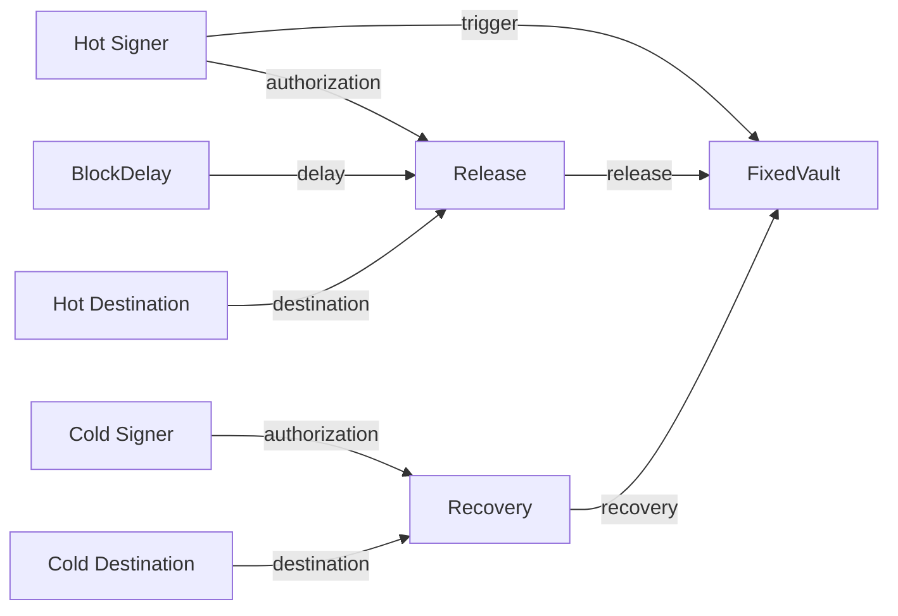

# Build a vault in Sapio Studio

This example turns ten small WASM modules into a custody construction kit.
Connect public keys, authorization rules, delays and destinations in Sapio
Studio, then compile the result into a contract you can inspect. Five saved
patches demonstrate a fixed vault, a quorum treasury, a delayed wallet, a
dynamic OP_VAULT withdrawal and a partial withdrawal with revaulting.

The examples use regtest, 100,000 satoshis of principal and public teaching
identities from [demo-identity.json](demo-identity.json). They generate modules,
patches and contract artifacts. Funding transactions, private keys, signer
configuration, a watchtower and broadcasting remain separate responsibilities.
The fixture's private keys are publicly derivable from its source. Use these
identities only for synthetic transactions or regtest funds.

## Build the kit and connect Studio

Use the current Sapio checkout containing this example and the modernized
[Sapio Studio](https://github.com/sapio-lang/sapio-studio), introduced in
[Studio PR #89](https://github.com/sapio-lang/sapio-studio/pull/89). Run these
commands from the Sapio repository root:

```sh
rustup show
cargo build --locked -p sapio-cli
python3 contrib/build-a-vault/build.py \
  --cli target/debug/sapio-cli \
  --workspace contrib/build-a-vault/target/studio-workspace \
  --output contrib/build-a-vault/target/generated
```

The pinned Rust toolchain includes `wasm32-unknown-unknown`. Building the
Bitcoin dependencies for WASM also needs a Clang with WebAssembly support.
On macOS, install Homebrew LLVM and set its compiler before running the build:

```sh
brew install llvm
export CC_wasm32_unknown_unknown="$(brew --prefix llvm)/bin/clang"
```

On Linux, set `CC_wasm32_unknown_unknown=clang` if Clang is not already selected.
The generator builds the release modules, loads them into the requested
workspace, executes every recipe and writes:

| Generated files | Purpose |
| --- | --- |
| `modules/*.wasm` | The ten modules to load into Studio. |
| `schemas/*.json` | Each module's actual input and result schemas. |
| `*.patch.json` | Editable Studio graphs, pinned to these exact WASM hashes. |
| `*.artifact.json` | Compiled custody programs. |
| `*.explanation.json` | CLI inspection results for those programs. |
| `manifest.json` | Module identities and the five matching patch/artifact pairs. |

In the Studio checkout, use Node 24 and run `npm ci`, `npm run build`, then
`npm start`. Use the desktop application to execute local modules; the browser
preview does not run this kit.

1. Open **Studio settings** or **Set up Sapio CLI**.
2. Set **Sapio CLI** to the absolute path of the executable you just built.
3. Set **Workspace** to the absolute path of
   `contrib/build-a-vault/target/studio-workspace` in this Sapio checkout.
4. Click **Save & check CLI**. No **Optional runtime config** is needed for
   compiling, inspecting or preparing local spends.
5. Select **Patch**, then **Open patch**, and open
   `target/generated/fixed-vault.patch.json` relative to this example.

Opening a patch fetches its module interfaces from the configured workspace.
If you use a different workspace, first use **Load WASM module** for each
required file under `target/generated/modules`, then reopen the patch.

## Understand the sockets

These patches connect **values**. For example, Signer produces a `KeySet`,
which fits Release's `/authorization` input. Release produces a `ReleaseRule`,
which fits FixedVault's `/release` input. Studio checks the advertised schemas
when connecting sockets and validates actual values during execution.

Use the whole **result** socket in each module's **RESULT** column. The separate
**Module reference** outlet passes a WASM module identity for a nested call;
none of these five recipes uses it.

| Module | Literal arguments and connected inputs | Result |
| --- | --- | --- |
| **Signer** | `key`: one x-only public key | `KeySet` requiring that signature |
| **Quorum** | `threshold`, `keys`: distinct x-only public keys | `KeySet` requiring the chosen threshold |
| **BlockDelay** | `blocks`: 1–65,535 | `RelativeDelay` |
| **Destination** | `address`: a destination on the compilation network | `AddressTarget` |
| **Recovery** | `/authorization`: `KeySet`; `/destination`: `AddressTarget` | `RecoveryRule` |
| **Release** | `/authorization`: `KeySet`; `/delay`: `RelativeDelay`; `/destination`: `AddressTarget` | `ReleaseRule` |
| **FixedVault** | `/trigger`: `KeySet`; `/release`: `ReleaseRule`; `/recovery`: `RecoveryRule`; `fee_sats` | Compiled fixed vault |
| **DelayedWallet** | `/hot`: `KeySet`; `/delay`: `RelativeDelay`; `/recovery`: `KeySet` | Compiled wallet |
| **EmulationOracle** | `xpub`: the emulator's public BIP32 root | `OracleRoot` |
| **OpVault** | `/trigger`: `KeySet`; `/recovery`: `RecoveryRule`; `/delay`: `RelativeDelay`; `/oracle`: `OracleRoot`; `/proposal/destination`: `AddressTarget`; `proposal.withdrawal_sats` | Compiled dynamic vault and its suggested withdrawal |

The canvas describes compilation dependencies. Its wires do not represent
Bitcoin transactions, signature delivery or the passage of time. Those
transaction relationships appear after compilation in **Inspect**. A delay
module is public data; the consuming contract determines which coin's
confirmation starts the delay.

Every node receives the same explicit **Compilation context**. Click the
network/amount control above the canvas to inspect it. The supplied patches use:

```json
{
  "amount": 100000,
  "network": "Regtest",
  "lowering": "Native"
}
```

The context editor exposes **Network**, **Available amount (sat)** and
**Covenant lowering**; **Use context** applies your edits. Amounts are satoshis.
Changing the context rebuilds every relevant dependency with that context.

## First patch: a fixed vault

In `fixed-vault.patch.json`, the left-hand Signer, BlockDelay and Destination
nodes feed Release and Recovery. Those assembled rules feed FixedVault:



1. Select the **BlockDelay** node. Its **Arguments JSON** contains
   `{"blocks":144}`.
2. Select **FixedVault**. Its literal argument is `{"fee_sats":500}`; the
   incoming wires supply `trigger`, `release` and `recovery` during the build.
3. Click **Build selected**. Select the terminal FixedVault node to build the
   whole contract; selecting Signer builds only that public authorization value.
4. Click **Review output**, then **Inspect as contract** in **Module result**.
5. In **Inspect**, select outputs and transactions to examine their policies,
   amounts, guards, sequences and funding constraints. **Show output list** is
   useful when the graph becomes crowded.

The supplied program has these movements:

| Movement | Required authorization | Result |
| --- | --- | --- |
| Trigger | Hot signature | 99,500 sat pending output; 500 sat reserved fee |
| Release pending output | Hot signature and 144-block relative delay | 99,000 sat to the fixed hot destination; another 500 sat fee |
| Recover directly | Cold signature | 99,500 sat to the fixed recovery destination |
| Recover while pending | Cold signature | 99,000 sat to that same recovery destination |

The 144-block clock starts when the **pending output confirms**, not when the
original vault was funded. It is a block count, not an exact wall-clock day.
Both destinations and the transaction amounts are committed when compiling
this fixed-vault recipe. Each hop pays its own fixed 500-sat fee.

These actions use native CTV under the supplied `Native` lowering. Studio
displays the native-CTV assumption in Inspect. Merely selecting Regtest does
not activate CTV on stock Bitcoin Core. To explore CTV signer emulation instead,
choose **CTV emulation with public signer roots** in the context editor, supply
the intended public roots and threshold, and rebuild. That produces a different
custody program with an explicit signer trust assumption.

### Make a change and wire a block yourself

Change BlockDelay to `{"blocks":288}`, select FixedVault and rebuild. Inspect
the pending release's sequence requirement, then **Save** the patch under a
new filename. Save an artifact separately with **Export JSON** or Inspect's
**Export** button. Saving a patch preserves the editable recipe; an artifact
preserves its compiled result.

To practice wiring, select the connection from BlockDelay to Release and use
the trash button, **Remove selected node or connection**. Then reconnect the
BlockDelay **result** socket to Release's `/delay` socket. You can also expand
**Connect sockets without dragging** in the selected node's inspector:

1. **Source module**: BlockDelay.
2. **Output**: `result`, rather than `Module reference (hash)`.
3. **Destination module**: Release.
4. **Input**: `/delay`.
5. Click **Connect**, select FixedVault and **Build selected**.

Connected values override the corresponding literal field at build time. Edit
the upstream BlockDelay to change a wired delay. Studio rejects a second
writer to the same input; remove the existing connection before replacing it.
Using Destination's result for `/delay` should produce an incompatible-schema
message, which is useful feedback while constructing a patch.

## Four more custody programs

### Quorum treasury

Open `quorum-treasury.patch.json`. A **Quorum** node supplies a 2-of-3 `KeySet`
to both FixedVault's `/trigger` and Release's `/authorization`. Cold recovery
remains controlled by its separate Signer. The 144-block delay and fee amounts
match the first recipe.

Select Quorum and change its `threshold` to `3`, keeping the three distinct
keys. Rebuild FixedVault and inspect both the trigger and release policies.
This demonstrates why one authorization block can feed several compatible
inputs. You can also add a separate Signer or Quorum using **Choose a module**
and **Add**, and wire it only to Release if triggering and releasing should
require different people. Keep keys distinct and thresholds between one and
the number of keys.

`KeySet` accepts up to 16 keys. Unusually large combinations of trigger and
recovery quorums can still exceed the normal WASM compiler fuel budget when
the whole contract is compiled. A valid socket schema does not guarantee that
every composition fits that budget; build the complete contract as you edit.

### Delayed wallet

Open `delayed-wallet.patch.json`, select **DelayedWallet** and build it. Hot
spending requires its Signer and a 1,008-block delay; recovery requires a
separate 2-of-3 Quorum without that delay.

Here the clock starts when the **wallet's funding output confirms**. There is
no trigger transaction or pending withdrawal stage. The paths authorize
ordinary spending and do not fix destination addresses. Inspect shows spending
policies rather than the transaction tree of the fixed vault. This recipe uses
ordinary signature and CSV conditions and does not need a covenant emulator.

Try replacing the recovery Quorum with a Signer. A single recovery key may
become the Taproot internal key, so inspect the resulting key-path and
script-path choices instead of assuming every authorization appears in a leaf.

### Dynamic OP_VAULT withdrawal

Open `op-vault.patch.json`, select **OpVault** and build it. This recipe uses
the contributed WASM OP_VAULT emulator, with its public root supplied by
**EmulationOracle**, and a 2-of-3 trigger authorization.

The vault commits its trigger authorization, fixed recovery destination,
recovery authorization, 144-block delay and emulator root. The withdrawal
destination is chosen in a **proposal**, supplied by the Destination wire into
`/proposal/destination`. Triggering replaces the trigger leaf with a delayed
CTV-emulated withdrawal leaf while retaining the recovery leaf and internal
key. The pending coin can still be recovered before withdrawal.

The default proposal moves all 100,000 sat into the pending output. After its
144-block confirmation delay, the selected withdrawal template sends all
100,000 sat to the proposed destination. A separate fee sponsor pays fees.

To see the distinction from a fixed vault, change the withdrawal Destination's
address to another regtest address and rebuild OpVault. Compare the source
vault address and the pending output address in Inspect: the source address
stays the same while the proposed pending output changes. Changing the recovery
destination, delay, trigger keys or oracle root changes the source policy.
The preview is a **suggested** transaction, not a commitment to use that one
withdrawal proposal forever.

### Partial withdrawal and revaulting

Open `op-vault-revault.patch.json`. The OpVault node contains:

```json
{
  "proposal": {
    "withdrawal_sats": 60000
  }
}
```

Its incoming wire supplies `proposal.destination`. The trigger creates a
60,000-sat pending output and returns 40,000 sat to the original vault script.
The pending 60,000 sat retain the same 144-block recovery window; the remaining
40,000 sat can start a separate withdrawal later. Fees come from a sponsor.

Change `withdrawal_sats` to `75000` and rebuild. Inspect should show 75,000 sat
pending and 25,000 sat revaulted, with the same source vault address. The
revault output is represented by its exact script without recursively expanding
every future withdrawal. Reusing its public vault terms constructs its next
proposal. A zero withdrawal or one above available principal is rejected.

## What the OP_VAULT emulator enforces

This is an intentionally restricted profile of the historical
[BIP345 OP_VAULT proposal](https://github.com/bitcoin/bips/blob/master/bip-0345.mediawiki).
BIP345 is closed and names BIP443 as its proposed replacement. The kit is a
demonstration of leaf replacement and recovery through Sapio's program
emulation; it is not a claim that OP_VAULT has activated on Bitcoin.

The profile uses one vault input and a fixed delayed-CTV replacement template.
It preserves every satoshi of vault principal in the pending/revault outputs,
or in the fixed recovery output. Additional inputs must be native witness-v0
fee sponsors, such as P2WPKH or P2WSH. Additional Taproot inputs and batching
multiple vault inputs are excluded. The generated templates declare a separate
`fee_sponsor` input with no sponsor change output; select its amount deliberately.
Their 100,000-sat maximum fee is a **local binding cap**, not a guarantee of an
appropriate fee rate and not an extra covenant condition.

The WASM runtime authenticates the selected tapscript hash against the spent
output before exposing it to the evaluator. The evaluator also verifies the
source inclusion proof and the replacement output. The generated vault has one
trigger leaf. A tapleaf hash identifies a script/version, not a unique physical
occurrence in an arbitrary tree containing duplicate identical leaves; this
tutorial makes no broader occurrence-binding claim.

OP_VAULT, recovery and final CTV are explicit `Program` policies here. Their
on-chain enforcement uses ordinary signatures and CSV, which stock Bitcoin
consensus understands. The emulation service must evaluate the committed
program honestly before signing, and remain available when a spend needs it.
Its private root can produce signatures without evaluating the program, so
compromising that root breaks the emulated covenant guarantee. The generated
public `xpub` is an identity for demonstration, not a configured signing
service. The patch's `Native` context does not turn these explicit Program
policies into native opcodes.

## Taking a reviewed artifact into Spend

The kit stops at public compilation artifacts. It does not include a complete
funding/signing runner. Studio's **Spend** tab becomes useful once an external
wallet or integration supplies a funded PSBT and the required adapter data.

For an OP_VAULT trigger or recovery, the selected template stores public
evidence at `metadata_map_s2s.op_vault_witness` in the artifact JSON. Trigger
evidence contains the withdrawal commitment, output indexes, revault amount,
source script and control block. Recovery evidence contains its selected
output index. The final withdrawal's CTV program needs an empty auxiliary
witness. These bytes contain no private signing material.

An integration must deliberately wrap those bytes in `ProgramEvidence` for
the exact validated program requirement and spending path. Its application
codec name must match the corresponding `ProgramCapability` in `SpendAssets`.
The evidence array entries have `requirement`, `codec` and `witness` fields;
the capability also declares `evidence_available` and `signer_available`.
Declaring availability grants no authorization. Sapio does not infer trust or
automatically load evidence from optional artifact metadata. Reconstruct the
evidence when changing the proposal, selected input or output arrangement.

With that integration in place, the Studio sequence is:

1. Open or compile the artifact and validate it through **Inspect as contract**.
   Use the artifact for the coin being spent: the pending contract has different
   spending paths from the source vault. Selecting a graph node alone does not
   replace the artifact used by Spend. **Occurrence location** gives the JSON
   pointer to that nested `receiving_contract`; an integration can export that
   complete object as its own artifact and open it with **Open artifact**.
2. In **Spend** → **Prepare new**, supply **Funded PSBT**, **Input index** and
   **Spending path**. For these OP_VAULT branches select **Taproot script path**
   and the exact **Tapleaf hash**. Include the selected prevout and all sponsor
   prevouts; the script/control-block proof must match the funded output.
3. Expand **Spending assets and Program evidence**. Supply **Assets JSON**
   describing the native keys and exact program capabilities, and **Evidence
   JSON** containing the selected program's public evidence array.
4. Click **Prepare intent**, then **Save intent** and **Save current PSBT**.
   The intent fixes the selected path for subsequent responses.
5. Click **Load Program requests**, review **Program and signer requirements**,
   then **Export request** for the intended emulation service. Import its
   **Signed response PSBT** with the correct **Request index** and click
   **Apply response**. **Sign & apply locally** is available when you explicitly
   provide a suitable local emulation key; this kit does not write key files.
6. Collect the ordinary trigger/recovery signatures too. **Sign native
   requirements locally** → **Choose key & sign** accepts an explicitly chosen
   local key file. A quorum requires the relevant distinct signers. The fee
   sponsor's own signatures remain part of the external wallet workflow.
7. Use **Validate & check status**, then **Finalize PSBT** or **Finalize
   transaction** when all required authorizations and funding checks pass.
   Exporting a finalized transaction does not broadcast it.

CSV confirmation maturity and current relay policy need a Bitcoin node's
view of the chain. Studio can inspect the transaction's sequence constraints;
it does not establish that 144 or 1,008 blocks have elapsed. A usable custody
system also needs monitoring and a practiced recovery process. Neither a
green build nor a saved intent provides a watchtower.

## Rebuild, reproduce and extend

WASM identity commits the exact module bytes. Rebuilding after a source or
toolchain change can produce new module hashes, so rerun `build.py` to load the
new modules and regenerate consistent patches. Do not replace a saved patch's
hashes by module names. Keep custom patches separate from generated files;
regeneration overwrites the generated recipes. `--skip-build` reuses existing
release WASM under `--target-dir` when only regenerating/loading recipes.

Run the native block tests from the Sapio root:

```sh
cargo test --manifest-path contrib/build-a-vault/Cargo.toml --workspace --locked
```

After generating the recipes, compare their WASM-produced artifacts against
native Rust execution of the same ten `Callable` building blocks:

```sh
cargo run --manifest-path contrib/build-a-vault/Cargo.toml \
  --locked -p build-a-vault-emulation --bin check-native -- \
  contrib/build-a-vault/target/generated
```

The native runner reconstructs the CLI/plugin compilation path from each
module hash and uses the saved context and value connections. It compares the
complete compiled JSON, including derived keys, script commitments and public
metadata. This checks that host-accelerated WASM operations retain native Rust
semantics.

To reproduce the visual execution through Studio's actual patch engine, run
from the Studio checkout, substituting absolute paths:

```sh
npm run build:desktop
node --import tsx /path/to/sapio/contrib/build-a-vault/studio-check.ts \
  --studio "$PWD" \
  --cli /path/to/sapio/target/debug/sapio-cli \
  --workspace /path/to/sapio/contrib/build-a-vault/target/studio-workspace \
  --artifacts /path/to/sapio/contrib/build-a-vault/target/generated
```

The check loads all ten exact module hashes, compiles their schemas, executes
every recipe through Studio and compares each output with the generated
artifact. It also asks the CLI to inspect each result. This checks composition
and serialization; it is not a funded-chain demonstration.

The source keeps contract definitions separate from orchestration:

| Source | Responsibility |
| --- | --- |
| [blocks/src/lib.rs](blocks/src/lib.rs) | Public typed ports and the eight ordinary building blocks |
| [blocks/src/contracts.rs](blocks/src/contracts.rs) | Fixed vault, pending state and delayed-wallet contract rules |
| [emulation/src/lib.rs](emulation/src/lib.rs) | Public oracle/proposal types and two emulation blocks |
| [emulation/src/contracts.rs](emulation/src/contracts.rs) | OP_VAULT source/pending policies and suggested transactions |
| [modules](modules) | Small WASM registrations for the ten modules |
| [build.py](build.py), [studio-check.ts](studio-check.ts) | Build, recipe generation and Studio integration checks |
| [emulation/src/bin/check-native.rs](emulation/src/bin/check-native.rs) | Native/WASM artifact parity check using the same typed blocks |
| [../../sapio-base/src/op_vault.rs](../../sapio-base/src/op_vault.rs) | Public evaluator constructors and witness/proof helpers |
| [../../evaluators/op-vault](../../evaluators/op-vault) | The WASM predicate used by the emulator |

To add a building block, define a small public input/result type, validate it at
its module boundary and register a WASM module. Reuse these public types for
compatible sockets. Keep wallet access, private keys, signing and monitoring
in the integration layer so a saved patch stays a reproducible public custody
program.
