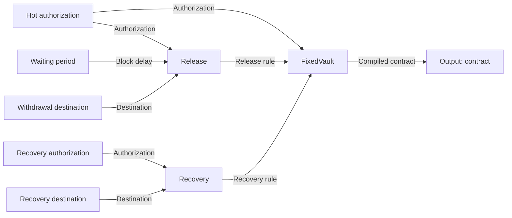

# Build a vault in Sapio Studio

Start with named public values, connect them to custody rules, and compile a
contract. The five supplied Studio patches cover a fixed vault, a quorum
treasury, a delayed wallet, an OP_VAULT withdrawal and partial revaulting. A
sixth exercise packages a recovery rule as a reusable patch.

The examples use regtest, 100,000 satoshis of principal and teaching identities
from [demo-identity.json](demo-identity.json). Those private keys are publicly
derivable from the source. Use these identities only for synthetic transactions
or regtest funds. Funding, private signing keys, monitoring and broadcasting
remain outside the saved public patches.

## Build the kit and connect Studio

Use the current Sapio checkout containing this example and
[Sapio Studio](https://github.com/sapio-lang/sapio-studio) with typed patch v2
support. From the Sapio repository root:

```sh
rustup show
cargo build --locked -p sapio-cli
python3 contrib/build-a-vault/build.py \
  --cli target/debug/sapio-cli \
  --workspace contrib/build-a-vault/target/studio-workspace \
  --output contrib/build-a-vault/target/generated
```

The pinned toolchain includes `wasm32-unknown-unknown`. Bitcoin's WASM build
also needs Clang with WebAssembly support. On macOS, install Homebrew LLVM:

```sh
brew install llvm
export CC_wasm32_unknown_unknown="$(brew --prefix llvm)/bin/clang"
```

On Linux, set `CC_wasm32_unknown_unknown=clang` if needed. The generator builds
ten WASM blocks, validates the teaching values through their constructors and
compiles every recipe. It writes:

| Generated files | Purpose |
| --- | --- |
| `modules/*.wasm` | Ten public constructors, composers and contract builders |
| `schemas/*.json` | Their exact typed input and result interfaces |
| `*.patch.json` | Editable v2 graphs with Variables and visibly wired Output terminals |
| `*.artifact.json` | Compiled custody programs |
| `*.explanation.json` | CLI inspection of those programs |
| `recovery-policy.patch.json` | Reusable recovery definition with two named inputs |
| `reusable-recovery.patch.json` | A fixed vault using that embedded definition |
| `manifest.json` | Module identities, constructor samples and matching artifacts |

In the Studio checkout, use Node 24 and run `npm ci`, `npm run build`, then
`npm start`. The desktop application executes the local modules; the browser
preview does not run this kit.

1. Open **Studio settings** or **Set up Sapio CLI**.
2. Set **Sapio CLI** to the absolute path of the executable you built.
3. Set **Workspace** to the absolute path of this example's
   `target/studio-workspace` directory.
4. Click **Save & check CLI**. No optional runtime config is needed to compile
   or inspect these examples.
5. Choose **Patch → Open patch** and open
   `target/generated/fixed-vault.patch.json`.

Studio reads each required module's interface from the workspace. A module
interface is cached under its exact immutable module hash. If you selected a
different workspace, use **Load WASM module** for the required files under
`target/generated/modules`, then reopen the patch.

## What plugs into what

Every socket names the value it expects. A **Waiting period** Variable emits a
**Block delay**; it fits Release's **Delay** input. A **Withdrawal destination**
Variable emits a **Destination**; it fits Release's **Destination** input.
Release combines those values with **Authorization** and emits a **Release
rule**, which fits FixedVault's **Release** input.

| Node category | What it does | Examples in this kit |
| --- | --- | --- |
| Variable | Supplies an editable public value without invoking WASM | Hot authorization, Waiting period, Emulation root |
| Composer | Calls a WASM module to assemble a typed value | Release, Recovery, Quorum |
| Contract builder | Compiles custody rules into an inspectable contract | FixedVault, DelayedWallet, OpVault |
| Reusable patch | Supplies named values to a saved graph and returns its named outputs | Recovery policy |
| Output | Names a graph result; receives one value and has no outgoing wires | Contract, Recovery |

A wire carries either a **value** or a **callable module implementation**.
These custody recipes use value wires. Callable outlets use a square socket
and appear explicitly when using a module as a callable. The calling module
supplies a callable's arguments; editing that module card's own inputs does
not configure the nested call.

Each input has one visible source:

- A local value, entered in the structured inspector.
- An explicitly chosen default, where the schema provides one.
- A connection from a named provider.

Connecting an input removes its local literal. Disconnecting leaves it unset;
there is no hidden fallback. A connection to an entire record owns its fields.
Connecting individual fields leaves their siblings editable. Two connections
cannot silently overwrite the same input.

Click an input to **Configure input**. Studio offers matching existing values,
**Create matching Variable**, and modules that produce the required type.
Alternatively use **Add Variable**, choose a type, and enter its value. Scalars,
records, lists and enum choices have structured editors. Values start unset;
an empty string, zero or the first enum choice is never silently invented.
Use **Extract Variable** to move an existing local value into a shared node.

Types distinguish public keys, addresses, amounts and block counts even where
their JSON representations look alike. A matching socket does not establish
available funding, confirmation maturity or the soundness of a complete
custody program. Studio validates actual values during a build, and the
consuming Sapio contracts enforce their domain constraints.

### The ten available WASM blocks

The generated recipes use Variables for their fixed public values. The
constructor modules remain available when another module needs to produce
those values programmatically, and the integration checks still exercise all
ten blocks.

| Block | Inputs | Result |
| --- | --- | --- |
| Single-key authorization (`signer`) | One x-only public key | Authorization requiring that key |
| Quorum | Threshold and distinct public keys | Authorization requiring the threshold |
| BlockDelay | 1–65,535 blocks | Block delay |
| Destination | Address on the compilation network | Destination |
| Recovery | Authorization, destination | Recovery rule |
| Release | Authorization, block delay, destination | Release rule |
| FixedVault | Trigger authorization, release rule, recovery rule, fee | Compiled fixed vault |
| DelayedWallet | Hot authorization, block delay, recovery authorization | Compiled wallet |
| EmulationOracle | Public BIP32 emulator root | Emulation root |
| OpVault | Trigger authorization, recovery rule, delay, emulation root, withdrawal proposal | Compiled dynamic vault and suggested withdrawal |

The canvas shows dependencies between public values. Transaction relationships
appear after compilation in **Inspect**. Wires do not deliver signatures or
advance time; the consuming contract determines which coin starts a delay.

Every WASM call, including calls inside reusable patches, receives the same
explicit **Compilation context**. The network/amount control above the canvas
opens **Network**, **Available amount (sat)** and **Covenant lowering**. These
patches use Regtest, 100,000 satoshis and Native lowering. Apply changes with
**Use context**. Variables themselves do not invoke WASM or consume its fuel.

## First patch: a fixed vault

Open `fixed-vault.patch.json`. The named Variables on the left supply Release
and Recovery; their assembled rules feed FixedVault, whose result is wired to
the **contract** Output terminal:



1. Select **Waiting period**. Its type is **Block delay** and its **Blocks**
   field is 144. Change it to 288 using the number field.
2. Select Release. Its inputs name their providers. Click the connected delay
   to navigate to the Waiting period Variable; edit the provider to change a
   connected value.
3. Select FixedVault. Its trigger, release and recovery inputs are connected;
   its fee is a local value of 500 satoshis.
4. Follow FixedVault's result wire to the **contract** Output terminal. Click
   its **Build output** button to build that result and all its dependencies.
   **Build patch** in the toolbar also builds this single connected terminal.
5. A contract output opens **Inspect** automatically. Review the transactions,
   amounts, guards, policies and funding constraints. Ordinary JSON outputs
   remain available through **Review output**.

A new patch starts with an unconnected **Result** Output. Connect the value
you want to build, or use **Add Output** to expose another result.
The wire is part of the saved graph, and the terminal's name becomes an output
field when the graph is used as a reusable patch. Each Output accepts one
value; it cannot supply downstream nodes. Several terminals can expose
different results. Moving nodes changes the layout. Editing a value,
connection, definition, exposed input/output name or compilation context
invalidates the result.

With the original 144-block delay, the supplied program has these movements:

| Movement | Required authorization | Result |
| --- | --- | --- |
| Trigger | Hot signature | 99,500 sat pending; 500 sat reserved fee |
| Release pending output | Hot signature and 144-block delay | 99,000 sat to the fixed hot destination; another 500 sat fee |
| Recover directly | Cold signature | 99,500 sat to the fixed recovery destination |
| Recover while pending | Cold signature | 99,000 sat to that same recovery destination |

The delay starts when the **pending output confirms**. It is a block count,
not an exact wall-clock day. Destinations and amounts are committed during
compilation, and each hop pays its fixed fee. With the edited 288-block value,
Inspect should show the longer pending-release sequence requirement.

These actions use native CTV with the supplied Native lowering. Selecting
Regtest does not activate CTV on stock Bitcoin Core. To explore signer
emulation, choose **CTV emulation with public signer roots** in the context
editor, provide the intended roots and threshold, and rebuild. That produces a
different custody program with an explicit signer trust assumption.

### Practice a connection

Disconnect Release's delay input. It becomes visibly unset. Click that input,
choose the existing **Waiting period** provider and reconnect it. You can also
drag the Variable's value socket to Release's matching input. A Destination
value does not fit a Block delay input; Studio explains the type mismatch.

To practice creating a value from an input, disconnect it again, choose
**Create matching Variable**, name the new Variable **Withdrawal delay**, and
enter its block count. Its type is selected from the input's actual interface.
One Variable can feed several compatible inputs.

Save the edited graph with **Save** under a new filename. **Export JSON** or
Inspect's **Export** saves the compiled artifact separately. A saved patch
preserves the recipe; a saved artifact preserves its current compiled result.

## Four more custody programs

### Quorum treasury

Open `quorum-treasury.patch.json`. **Hot authorization** is an Authorization
Variable with threshold 2 and three distinct keys. It feeds both the trigger
and Release's authorization. Recovery uses its separate authorization Variable.

Change **Threshold** to 3 and rebuild. Inspect both trigger and release
policies. To use different people for release, create a separate Authorization
Variable at Release's input instead of sharing the hot one. You can also add a
Quorum composer and supply its public-key list through a Variable.

Authorization accepts up to 16 distinct keys and a threshold between one and
the number of keys. Some unusually large combinations of trigger and recovery
quorums can exceed the WASM compiler's fuel budget. Compile the complete
contract as you edit; valid socket types alone do not establish a fuel bound.

### Delayed wallet

Open `delayed-wallet.patch.json` and compile its **contract** Output. Hot spending
requires its authorization and a 1,008-block delay; recovery requires a separate
2-of-3 authorization without that delay.

Here the clock starts when the **wallet's funding output confirms**. There is
no trigger or pending withdrawal, and neither path fixes a destination. This
uses ordinary signatures and CSV without covenant emulation. Change Recovery
authorization to threshold 1 with a single key to compare the resulting key
path and script paths; a single recovery key may become the Taproot internal
key.

### Dynamic OP_VAULT withdrawal

Open `op-vault.patch.json` and compile its **contract** Output. **Emulation root**
is a public Variable, and Hot authorization requires two of three keys. The
vault commits its trigger and recovery authorizations, fixed recovery
destination, 144-block delay and emulator root.

**Withdrawal destination** supplies the destination inside the withdrawal
proposal. That proposal selects where funds will go after triggering. The
trigger replaces one leaf with a delayed CTV-emulated withdrawal while
retaining the recovery leaf and internal key. The pending coin remains
recoverable before withdrawal.

The default proposal moves all 100,000 sat into the pending output. After its
144-block confirmation delay, the selected withdrawal sends those 100,000 sat
to the proposed destination. An external sponsor pays the fees.

Change Withdrawal destination to another regtest address and rebuild. Compare
the source and pending addresses in Inspect: the source remains the same while
the proposed pending output changes. Changing recovery destination, delay,
authorization or emulation root changes the source policy. The preview is a
suggested transaction, not a commitment to use that proposal forever.

### Partial withdrawal and revaulting

Open `op-vault-revault.patch.json`. Select OpVault and expand its **Proposal**
fields. The withdrawal amount is a local 60,000-sat value; its destination is
connected to Withdrawal destination.

The trigger creates a 60,000-sat pending output and returns 40,000 sat to the
original vault script. The pending portion has the same 144-block recovery
window. The remaining principal can begin a separate withdrawal later, with
fees supplied externally.

Change the proposal's withdrawal amount to 75,000 and rebuild. Inspect should
show 75,000 sat pending and 25,000 sat revaulted, with the same source address.
Try **Extract Variable** on that amount to make a named **Withdrawal amount**
node. The compiled program stays the same when extracting the existing value.
A zero withdrawal or one above available principal is rejected.

The revault output contains its exact script without recursively expanding
every future withdrawal. Reusing its public terms constructs its next proposal.

## Package a reusable recovery rule

Open `reusable-recovery.patch.json`. It compiles the same fixed vault as the
first recipe, but the Recovery composer is inside a **Recovery policy**
reusable patch. Its outer inputs are **Authorization** and **Destination**;
its named output is **Recovery**.

Select Recovery policy and use **Edit definition** to inspect its two named
patch inputs, the Recovery composer and the connected **recovery** Output.
**Import reusable patch** can add the
standalone `recovery-policy.patch.json` definition to another graph. Connect an
Authorization and Destination to its exposed inputs, then connect its Recovery
output to a vault. The definition travels inside the saved outer patch, so
editing another copy does not silently change this custody program.

To author the same abstraction yourself:

1. Make a small graph with Authorization and Destination Variables feeding a
   Recovery composer.
2. Select each Variable and **Expose as parameter**. Give the inputs the names
   `authorization` and `destination`.
3. Name the initial Output `recovery` and wire Recovery's result into it.
4. Save the patch. **Import reusable patch** in the consuming graph exposes
   those names as typed sockets.

The generated standalone definition intentionally has no default inputs; its
caller must supply both. All nested calls inherit the outer compilation
context. The integration check compares this embedded recipe with the original
fixed-vault artifact, including every field of the compiled JSON value.

## What the OP_VAULT emulator enforces

This is an intentionally restricted profile of the historical
[BIP345 OP_VAULT proposal](https://github.com/bitcoin/bips/blob/master/bip-0345.mediawiki).
BIP345 is closed and names BIP443 as its proposed replacement. The kit is a
demonstration of leaf replacement and recovery through Sapio's program
emulation; it is not a claim that OP_VAULT has activated on Bitcoin.

The profile uses one vault input and a fixed delayed-CTV replacement template.
It preserves every satoshi of vault principal in the pending/revault outputs,
or in the fixed recovery output. Additional inputs must be native witness-v0
fee sponsors, such as P2WPKH or P2WSH. Additional Taproot inputs and batching
multiple vault inputs are excluded. The generated templates declare a separate
`fee_sponsor` input with no sponsor change output; select its amount deliberately.
Their 100,000-sat maximum fee is a **local binding cap**, not a guarantee of an
appropriate fee rate and not an extra covenant condition.

The WASM runtime authenticates the selected tapscript hash against the spent
output before exposing it to the evaluator. The evaluator also verifies the
source inclusion proof and the replacement output. The generated vault has one
trigger leaf. A tapleaf hash identifies a script/version, not a unique physical
occurrence in an arbitrary tree containing duplicate identical leaves; this
tutorial makes no broader occurrence-binding claim.

OP_VAULT, recovery and final CTV are explicit `Program` policies here. Their
on-chain enforcement uses ordinary signatures and CSV, which stock Bitcoin
consensus understands. The emulation service must evaluate the committed
program honestly before signing, and remain available when a spend needs it.
Its private root can produce signatures without evaluating the program, so
compromising that root breaks the emulated covenant guarantee. The generated
public `xpub` is an identity for demonstration, not a configured signing
service. The patch's `Native` context does not turn these explicit Program
policies into native opcodes.

## Taking a reviewed artifact into Spend

Studio carries a compiled graph through binding and into **Spend**. Binding
links transaction templates to funding and produces PSBTs; it does not create
real coins or sign transactions. The kit's public identities and synthetic
funding are suitable for previewing that workflow. Real spending still needs
funding, signer keys and, for OP_VAULT, the required emulation service and
adapter data.

1. Build the **contract** Output or use **Open artifact**. Inspect starts with
   an **Unbound template graph**. Follow **Next transactions** and their output
   allocations to inspect the pending contract and its release/recovery paths.
2. Choose **Bind graph**. Binding uses the optional runtime configuration from
   Studio settings; it must describe the intended network and covenant mode.
   **Synthetic preview funding** produces a **Mock-bound preview**. **Explicit
   outpoint** or **Funding PSBT** produces a graph **Bound to supplied funding**;
   that label does not establish confirmation or current spendability.
3. The bound graph stays visible with linked outpoints and transactions. Select
   a transaction and choose **Review spend**. Studio carries that transaction's
   PSBT and the contract occurrence it spends into **Spend**, including when
   that occurrence is a nested pending contract. It checks available spending
   paths automatically and displays funding requirements separately from
   missing authorizations.
4. Use **Export bound graph** to save the linked graph, or **Export PSBT** on a
   selected transaction to continue with an external wallet. **Back to graph**
   returns to the selected transaction. No step signs or broadcasts implicitly.

For a fixed vault, try the pending transaction, follow its **pending** output,
then choose its **release** transaction and **Review spend**. The selected
spending policy commits that release template, whose **Input requirements**
in Inspect show a sequence of 144 blocks. Synthetic funding lets you inspect
the path and funding checks; it cannot establish that the delay has matured.

For an OP_VAULT trigger or recovery, the selected template stores public
evidence at `metadata_map_s2s.op_vault_witness` in the artifact JSON. Trigger
evidence contains the withdrawal commitment, output indexes, revault amount,
source script and control block. Recovery evidence contains its selected
output index. The final withdrawal's CTV program needs an empty auxiliary
witness. These bytes contain no private signing material.

An integration must deliberately wrap those bytes in `ProgramEvidence` for
the exact validated program requirement and spending path. Its application
codec name must match the corresponding `ProgramCapability` in `SpendAssets`.
The evidence array entries have `requirement`, `codec` and `witness` fields;
the capability also declares `evidence_available` and `signer_available`.
Declaring availability grants no authorization. Sapio does not infer trust or
automatically load evidence from optional artifact metadata. Reconstruct the
evidence when changing the proposal, selected input or output arrangement.

With that integration in place, continue in Spend:

1. Review **Funded PSBT** and **Input index**, or supply a wallet-prepared PSBT.
   OP_VAULT needs an external fee sponsor, including that sponsor's prevout;
   its public proposal does not provide sponsor funding. Use **Check available
   paths** after changing the PSBT and choose the intended script path. The
   script/control-block proof must match the funded output. When importing an
   artifact and PSBT manually, use the complete artifact for the coin being
   spent; a pending contract has different paths from the source vault.
2. Expand **Spending assets and Program evidence**. Supply **Assets JSON**
   describing the native keys and exact program capabilities, and **Evidence
   JSON** containing the selected program's public evidence array.
3. Click **Prepare intent**, then **Save intent** and **Save current PSBT**.
   The intent fixes the selected path for subsequent responses.
4. Click **Load Program requests**, review **Program and signer requirements**,
   then **Export request** for the intended emulation service. Import its
   **Signed response PSBT** with the correct **Request index** and click
   **Apply response**. **Sign & apply locally** is available when you explicitly
   provide a suitable local emulation key; this kit does not write key files.
5. Collect the ordinary trigger/recovery signatures too. **Sign native
   requirements locally** → **Choose key & sign** accepts an explicitly chosen
   local key file. A quorum requires the relevant distinct signers. The fee
   sponsor's own signatures remain part of the external wallet workflow.
6. Use **Validate & check status**, then **Finalize PSBT** or **Finalize
   transaction** when all required authorizations and funding checks pass.
   Exporting a finalized transaction does not broadcast it.

CSV confirmation maturity and current relay policy need a Bitcoin node's
view of the chain. Studio can inspect the transaction's sequence constraints;
it does not establish that 144 or 1,008 blocks have elapsed. A usable custody
system also needs monitoring and a practiced recovery process. Neither a
green build nor a saved intent provides a watchtower.

## Rebuild, reproduce and extend

WASM identity commits the exact module bytes. Rebuilding after a source or
toolchain change can produce new module hashes, so rerun `build.py` to load the
new modules and regenerate consistent patches. Do not replace a saved patch's
hashes by module names. Keep custom patches separate from generated files;
regeneration overwrites the generated recipes. `--skip-build` reuses existing
release WASM under `--target-dir` when only regenerating/loading recipes.

Run the native block tests from the Sapio root:

```sh
cargo test --manifest-path contrib/build-a-vault/Cargo.toml --workspace --locked
```

After generating the recipes, compare their WASM-produced artifacts against
native Rust execution of the same constructors, Variables and `Callable` builders:

```sh
cargo run --manifest-path contrib/build-a-vault/Cargo.toml \
  --locked -p build-a-vault-emulation --bin check-native -- \
  contrib/build-a-vault/target/generated
```

The native runner reconstructs the CLI/plugin compilation path from each
module hash and uses the saved context, literal Variables and value connections.
It follows the Output terminal's wire and checks the constructor samples that
supplied the original literals. It compares the complete compiled JSON,
including derived keys, script commitments and public
metadata. This checks that host-accelerated WASM operations retain native Rust
semantics.

To reproduce the visual execution through Studio's actual patch engine, run
from the Studio checkout, substituting absolute paths:

```sh
npm run build:desktop
node --import tsx /path/to/sapio/contrib/build-a-vault/studio-check.ts \
  --studio "$PWD" \
  --cli /path/to/sapio/target/debug/sapio-cli \
  --workspace /path/to/sapio/contrib/build-a-vault/target/studio-workspace \
  --artifacts /path/to/sapio/contrib/build-a-vault/target/generated
```

The check loads all ten exact module hashes, validates the constructor samples,
executes all five typed recipes and the reusable recovery example, and compares
each connected Output with its generated artifact. It verifies that Variables bypass WASM
and asks the CLI to inspect each result. This checks composition
and serialization; it is not a funded-chain demonstration.

The source keeps contract definitions separate from orchestration:

| Source | Responsibility |
| --- | --- |
| [blocks/src/lib.rs](blocks/src/lib.rs) | Public typed ports and the eight ordinary building blocks |
| [blocks/src/contracts.rs](blocks/src/contracts.rs) | Fixed vault, pending state and delayed-wallet contract rules |
| [emulation/src/lib.rs](emulation/src/lib.rs) | Public oracle/proposal types and two emulation blocks |
| [emulation/src/contracts.rs](emulation/src/contracts.rs) | OP_VAULT source/pending policies and suggested transactions |
| [modules](modules) | Small WASM registrations for the ten modules |
| [build.py](build.py), [studio-check.ts](studio-check.ts) | Build, recipe generation and Studio integration checks |
| [emulation/src/bin/check-native.rs](emulation/src/bin/check-native.rs) | Native/WASM artifact parity check using the same typed blocks |
| [../../sapio-base/src/op_vault.rs](../../sapio-base/src/op_vault.rs) | Public evaluator constructors and witness/proof helpers |
| [../../evaluators/op-vault](../../evaluators/op-vault) | The WASM predicate used by the emulator |

To add a building block, define a small public input/result type, validate it at
its module boundary and register a WASM module. Reuse the shared Rust DTOs and
their semantic `x-sapio-type` annotations for compatible sockets. A callable
reference exports its expected arguments and returns under `x-sapio-module`;
Sapio checks that interface before invoking the referenced implementation. Keep wallet access, private keys, signing and monitoring
in the integration layer so a saved patch stays a reproducible public custody
program.
