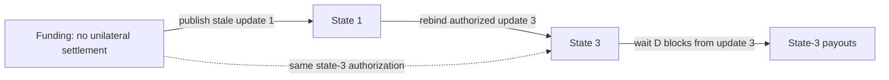

# Eltoo-style updates with TemplateHash, IKEY and CSFS

This executable Sapio example separates a channel's signed updates from its
delayed settlement. A participant can apply the latest jointly authorized
update to an older published state. The example uses the existing v2 WASM
fragments, Sapio continuations, and ordinary Bitcoin timelocks.

```sh
cargo run --locked -p sapio_integration_tests --example eltoo
```

The executable uses disposable keys and synthetic funding. It prints compiled
contracts and an update/settlement demonstration; it does not contact a wallet
or broadcast transactions. The public contract is
[`Channel`](../sapio-contrib/src/contracts/eltoo/mod.rs), with immutable
[`Terms`](../sapio-contrib/src/contracts/eltoo/terms.rs). It contains no private
keys, network selection, PSBT assembly or signing code.

The separate [runner](../integration_tests/src/eltoo_example/runner.rs) chooses
a compilation context, proposes transitions, binds coins and collects
signatures. [Fixtures](../integration_tests/src/eltoo_example/fixture.rs) and
[chain recovery](../integration_tests/src/eltoo_example/recovery.rs) are separate
modules. A caller constructs source with `terms.funding()` or
`terms.state(state)?`, then uses Sapio's ordinary `compile(context)` API.

## Three spending paths

Let `K` be a fresh joint channel key, `n` a state number, and `D` the contest
delay in blocks. `TL(n) = 500_000_000 + n` encodes bounded state numbers as
timestamps in the past. It orders states without making updates wait for a
future block height or wall-clock time.

The conceptual state contract is:

```text
internal key: K                         # cooperative close

update:
    After(TL(n + 1))
    AND CSFS(TemplateHash(transaction), IKEY, update_authorization)

settle:
    Older(D)
    AND TemplateHash(transaction) == expected_settlement_hash(n)
```

Sapio compiles the timelocks into native CLTV/CSV guards. The two predicates
use `template_signed_by(TemplateKey::InternalKey, oracle_root)` and
`template_hash_eq(expected_hash, oracle_root)`. These return ordinary public
`EmulatedProgram` policies, composed with the native guards. Both branches
are continuations using the existing v2 evaluators.

The settlement predicate comes from the same canonical template builder as
the payout continuation, using the caller's compilation context. Constructing
a state only validates public terms; it does not run a hidden compilation.
`compile_policy_leaf` lowers the policy through the checked contract compiler
when the recovery publication needs its exact script commitment.

The compiler explicitly pins `K`, backed by a separate cooperative key-path
authorization. IKEY therefore observes the same physical key in every state.
The oracle's program-derived keys live in script leaves. A known-tweak proof
is unnecessary for this arrangement.

Funding has the cooperative and update paths only. It has no settlement path:
funding can age while the channel stays off-chain without exhausting the
contest window. The first confirmed update starts that window. This follows
the trigger requirement in the [original eltoo paper](https://blockstream.com/eltoo.pdf).

At the maximum supported state the update branch is omitted, while settlement
and cooperative close remain available. State arithmetic cannot wrap. The
example accepts positive block delays and an explicitly bounded historical
state-number interval.

## Reusing authorization, then settling the latest state

An update to state 3 commits to its destination contract, capacity, state
locktime, sequence vector and publication output. The parties sign its
TemplateHash once. Because the hash omits input outpoints, this same CSFS
authorization can be used against funding, state 1, or state 2. See
[BIP446](https://github.com/bitcoin/bips/blob/master/bip-0446.md) for the committed
transaction fields.



Rebinding replaces the input outpoint, previous-output data and Taproot proof.
The emulator evaluates the unchanged auxiliary signature in the new context,
then supplies a fresh ordinary Taproot `SIGHASH_ALL` signature. The sponsor also
signs the actual transaction. Those transaction signatures cannot be copied
between the direct and rebound spends.

An old or equal update cannot pass the newer state's native CLTV guard, even
if its auxiliary signature remains valid. The WASM signature predicate and
the native timelock are separate requirements: obtaining an emulator signature
does not imply that the complete spending policy is satisfied.

Each state commits to its own settlement transaction, including `TL(n)` as the
settlement's locktime. This keeps settlement commitments distinct even when
two states have identical balances. The update and settlement use different
program instances and derived signing keys; a settlement cannot borrow an
update signature to bypass its CSV guard.

The structure follows the update/hash-equality separation in the
[TemplateHash LN-Symmetry draft](https://github.com/instagibbs/bolts/blob/2026-01-eltoo_th/XX-eltoo-transactions.md).
It demonstrates balances and contest logic rather than the complete Lightning
transaction format, HTLCs, or package-relay policy.

## Recovering an old state's proof

The latest state alone does not contain the old state's Taproot sibling hash.
Each update therefore publishes the hash of its actual lowered settlement
leaf in a zero-value OP_RETURN output:

```text
OP_RETURN <"eltoo/v1" || settlement_tapleaf_hash[32]>
```

The payload is exactly 40 bytes. A participant observing an old update can
rebuild its balance-independent update script with `terms.update_script(n)`,
combine it with this sibling, and recover a control block. This lowers the
update policy directly; it does not invent an old allocation or compile a
throwaway channel.
Recovery verifies that proof against the actual spent P2TR output before using
it. The publication is evidence to check, not trusted PSBT metadata.

The example recovers state 1 from its serialized transaction while retaining
only the channel terms and the latest state. It does not require state 1's
payout distribution, compiled descriptor or old PSBT. Altered publication
data or a mismatched output key is rejected.

## Fees and keys

Updates preserve channel capacity. Both update and settlement templates reserve
two inputs before authorization: channel input 0 and a sponsor input 1. The
sponsor contributes all of its input value as fees; there is no fee-change
output. The contract reserves the input without inventing a sponsor amount;
the runner's chosen coin determines the fee. An alternative sponsor outpoint or amount can be substituted before
the ordinary transaction signatures are collected.

TemplateHash commits the complete sequence vector. Adding an input after
authorization changes the template and is not supported. The example uses
version 2, zero relative delay for update/sponsor inputs, and the agreed block
delay for the settlement's channel input. This keeps construction within
Sapio's normal template builder API.

`K` must be fresh for each channel. Reusing a joint key across independent
channels permits update authorization to cross between them; a local channel
label does not prevent that. The fixture uses a disposable keypair to stand in
for a joint signer. It is not a MuSig2 implementation; real participants
would use an appropriate joint signing protocol and nonce management.

This remains covenant emulation under Sapio's existing oracle assumptions.
Bitcoin Core enforces the ordinary signatures, Taproot proofs and timelocks.
The oracle executes TemplateHash/IKEY/CSFS through WASM before signing. The
auxiliary authorization is off-chain evidence, and this example uses no annex.

## Executable checks

```sh
cargo test --locked -p sapio_integration_tests --test eltoo_security
cargo build --locked -p sapio_integration_tests --example eltoo_vectors
python3 contrib/check_eltoo.py /path/to/bitcoind /path/to/bitcoin-cli \
  target/debug/examples/eltoo_vectors
```

The node check creates an isolated regtest chain, ages funding, confirms stale
state 1, and supersedes it with state 3. It checks that state 1's settlement
loses its input, that state 3 cannot settle at state 1's earlier deadline, and
that the agreed payouts confirm after state 3's own contest window.
Equal and backward updates have authentic auxiliary and transaction signatures
but fail Core's native CLTV check. The test exporter assembles those two invalid
witnesses explicitly after verifying that the normal finalizer rejects them.

For a state confirmed at height `H`, a delay of `D` permits settlement in block
`H + D`. Mempool admission considers the next block, so acceptance begins at
tip height `H + D - 1`, following
[BIP68](https://github.com/bitcoin/bips/blob/master/bip-0068.mediawiki).
